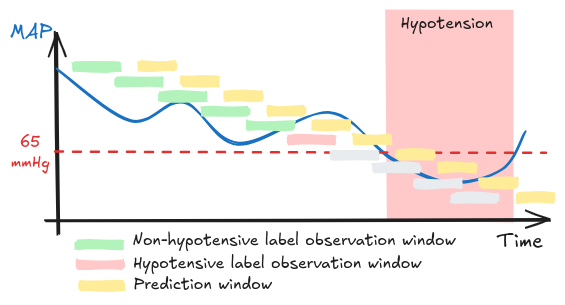
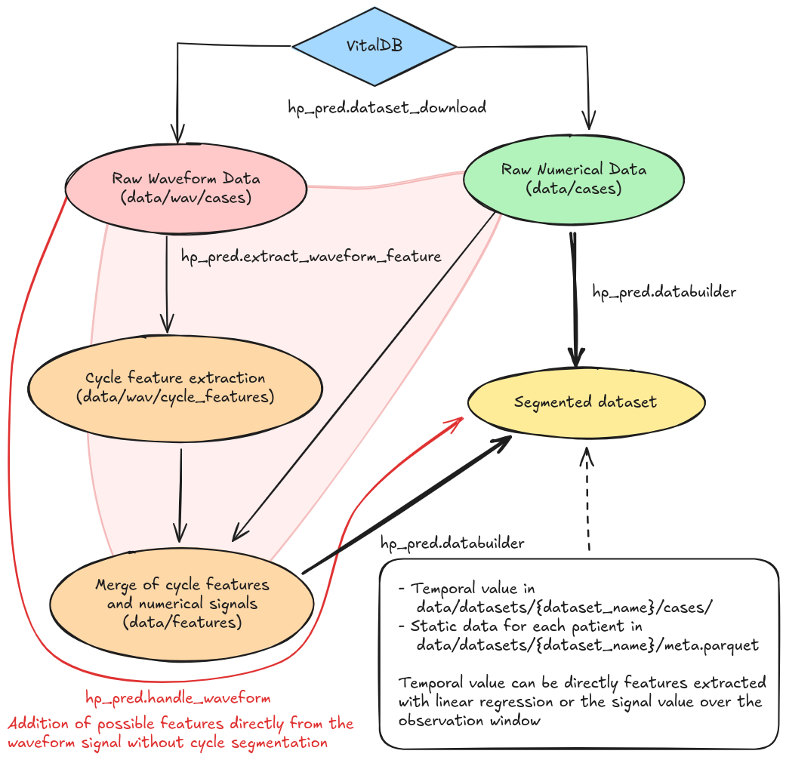

# Hypotension_pred

Use a data-based approach to predict intra-operative hypotension. The main idea is to use a sliding window approach to segment the data and then use a machine learning model to predict hypotension.



## Installation

Use a new virtual env and Python 3.11 (with pyenv) for maximal compatibility.

```bash
git clone https://github.com/BobAubouin/hypotension_pred hp_pred
cd hp_pred
pip install .
```

### Dev / Contribution

In addition, you can add the optional build `dev`. So you will download the Python packages required to develop the project (unit test, linter, formatter).

```bash
git clone https://github.com/BobAubouin/hypotension_pred hp_pred
cd hp_pred
pip install -e .[dev]
```

## Use

### Download raw data from VitalDB

The data used are from the [VitalDB](https://vitaldb.net/) open dataset. You must read the [Data Use Agreement](https://vitaldb.net/dataset/#h.vcpgs1yemdb5) before using it.

 To download the data you can use the package's command `python -m hp_pred.dataset_download`. The help command outputs the following:

```bash
usage: dataset_download.py [-h] [-l {CRITICAL,FATAL,ERROR,WARN,WARNING,INFO,DEBUG,NOTSET}] [-s GROUP_SIZE] [-o OUTPUT_FOLDER]

Download the VitalDB data for hypertension prediction.

options:
  -h, --help            show this help message and exit
  -l {CRITICAL,FATAL,ERROR,WARN,WARNING,INFO,DEBUG,NOTSET}, --log_level_name {CRITICAL,FATAL,ERROR,WARN,WARNING,INFO,DEBUG,NOTSET}
                        The logger level name to generate logs. (default: INFO)
  -s GROUP_SIZE, --group_size GROUP_SIZE
                        Amount of cases dowloaded and processed. (default: 950)
  -o OUTPUT_FOLDER, --output_folder OUTPUT_FOLDER
                        The folder to store the data and logs. (default: data)
```

### Create the segmented dataset

The class `hp_pred.databuilder.DataBuilder` is used to create the segmented dataset with a sliding window approach. An example of use is given in the `scripts/dataset_build/base_dataset.py` scripts. If you do not want to use features extracted using linear regression you can check the `scripts/dataset_build/signal_dataset.py` script.

### Recreate JBHI results

The results associated with our paper can be replicated using the version of the git tagged 'jbhi_XP'.

- First download data from VitalDB using the command `python -m hp_pred.dataset_download`. It will download the raw data in the `data/cases` foler.
- Then create the segmented dataset running the script `scripts/dataset_build/30_s_dataset.py`. It will create a new folder in `data/datasets` with the segmented data.
- Train the XGB model using the script `scripts/experiments/train_model.py`, approximately 1h. It will save the model in the `data/models` folder.
- Finally, you can show the results using the notebook `scripts/experiments/show_results.ipynb`.
- Study of the leading time influence can be done using the notebook `scripts/experiments/studyleading_time.ipynb`.

Results might slightly differ due to the randomness of the model.
Note that the results associated with data from Grenoble Hospital can not be replicated as the data is not public.

### Work with waveform data

There are actually two ways to work with waveform data:

- The first one is to use the `hp_pred.databuilder.DataBuilder` class to create the segmented dataset with numerical signal and then add fetures extracted directly from the waveform signal. Two method are coded to extract features from the waveform signal TSfresh and Minirocket. Those new features extracted from the waveform are stored in the folder `data/{dataset}/wave_rocket_features` or `data/{dataset}/wave_tsfresh_features` where dataset is the name of the dataset.
- The second way is to use the `hp_pred.extract_AP_waveform_features` function to segment the waveform signal into cycle and then extract features from each cycle. Those features are then merged with the numerical signal and `hp_pred.databuilder.DataBuilder` is used to create the segmented dataset. In this case, the features extracted from the waveform signal are first stored in the folder `data/wav/cycle_features` and then merged with the numerical signal in the folder `data/features`.

### data flow



## Citation

If you use this code in your research, please cite our paper.
